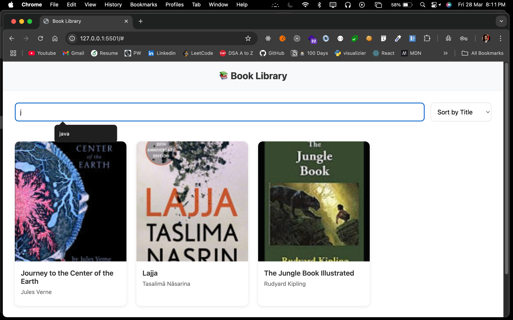
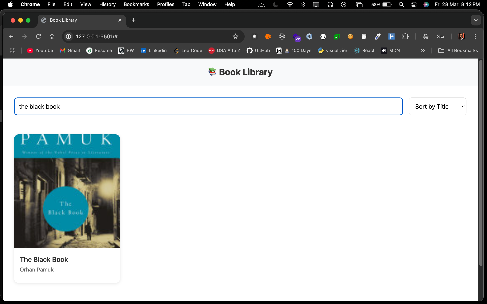
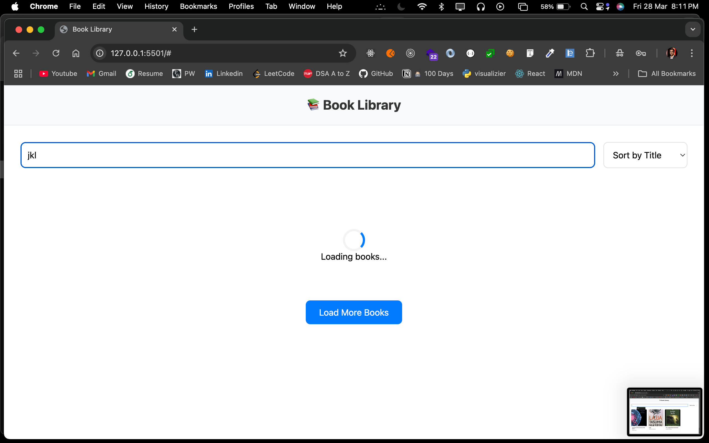

# 📚 Book Library

A modern, responsive web application for browsing and discovering books using the Google Books API. 

## Live Demo

-  [Live Preview](https://book-library-ecru.vercel.app/)
-  [GitHub Repository](https://github.com/nileshhaldar98/book-library)

## Features

###  Responsive Book Grid
- Beautiful grid layout that adapts to different screen sizes
- Book cards displaying cover images, titles, and authors
- Placeholder images for books without covers

### 🔍 Search Functionality
- Real-time search as you type
- Search by book title or author

### Dynamic Sorting
- Sort books by:
  - Title (alphabetically)
  - Author (alphabetically)
  - Publication Date (newest first)

### Infinite Scrolling
- Load more books as you scroll
- Smooth loading experience with loading indicators
- Pagination support for better performance

## Technical Features

- Asynchronous API calls using Fetch API
- Error handling and loading states
- Modular JavaScript code structure
- CSS Grid and Flexbox for responsive layouts
- Font Awesome icons integration

## Getting Started

1. Clone the repository
2. Open `index.html` in your web browser
3. Start exploring books!

## Screenshots

### Main Interface

### Search and Sort

### Loading State

## Technologies Used

- HTML5
- CSS3
- JavaScript (ES6+)
- Google Books API
- Font Awesome Icons